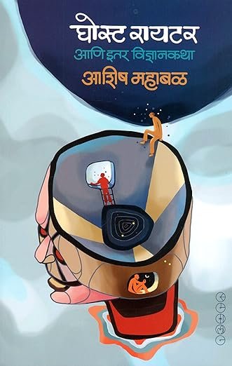

# Writings

[**Ghost Writer**](publications/venues/venue-54714bad4d/index.html) घोस्ट रायटर आणि इतर विज्ञानकथा, २०२३, समकालीन प्रकाशन

[Amazon India](https://www.amazon.in/Ghost-Writer-Vidnyan-Katha-%E0%A4%B5%E0%A4%BF%E0%A4%9C%E0%A5%8D%E0%A4%9E%E0%A4%BE%E0%A4%A8%E0%A4%95%E0%A4%A5%E0%A4%BE/dp/9392624131) ·
[Kindle](https://www.amazon.in/GHOST-WRITER-%E0%A4%98%E0%A5%8B%e0%a4%b8%e0%a5%8d%e0%a4%9f-%e0%a4%b0%e0%a4%be%e0%a4%af%e0%a4%9f%e0%a4%b0-%e0%a4%b5%e0%a4%bf%e0%a4%9c%e0%a5%8d%e0%a4%9e%e0%a4%be%e0%a4%a8%e0%a4%95%e0%a4%a5%e0%a4%be-ebook/dp/B0CB1JCGZM/ref=tmm_kin_swatch_0) ·
[BookGanga](https://www.bookganga.com/eBooks/Books/details/4733992183857805843?BookName=%e0%a4%98%e0%a5%8b%e0%a4%b8%e0%a5%8d%e0%a4%9f%20%e0%a4%b0%e0%a4%be%e0%a4%af%e0%a4%9f%e0%a4%b0%20%e0%a4%86%e0%a4%a3%e0%a4%bf%20%e0%a4%87%e0%a4%a4%e0%a4%b0%20%e0%a4%b5%e0%a4%bf%e0%a4%9c%e0%a5%8d%e0%a4%9e%e0%a4%be%e0%a4%a8%e0%a4%95%e0%a4%a5%e0%a4%be)

I have been writing science fiction stories in Marathi for several years. Published primarily in Diwali issues, the first book with 18 of those came out in 2023.
I also write non-fiction in Marathi and in English (astronomy, rationalism, essays, travelogues). On this site you will find details of my non-professional writings (mind you, I said non-professional, and not un-professional). The professioanl i.e. academic writings can be found is usual places like [Google Scholar](https://scholar.google.com/citations?user=Ww9DSqAAAAAJ&hl=en), [arXiv](https://arxiv.org/search/?query=mahabal+a&searchtype=all&abstracts=show&order=-announced_date_first&size=500), [ADS](https://ui.adsabs.harvard.edu/search/fq=%7B!type%3Daqp%20v%3D%24fq_database%7D&fq_database=(database%3Aastronomy%20OR%20database%3Aphysics)&q=%20author%3A%22mahabal%22&sort=date%20desc%2C%20bibcode%20desc&p_=0), or my work website: [aschig's Universe](https://sites.astro.caltech.edu/~aam/) (but that is often hopelessly outdated - work, you know).

मी गेली अनेक वर्षे मराठीत विज्ञानकथा लिहीत आहे. मुख्यतः दिवाळी अंकांमधून प्रकाशित झालेल्या या कथांपैकी १८ कथांचे पहिले पुस्तक २०२३ साली प्रकाशित झाले.
याशिवाय मी खगोलशास्त्र, विज्ञान, विवेकवाद, प्रवास आणि ललित लेखनही करतो.

  

<!-- AUTO:HOME_NAV:START -->
## Sections

- [Fiction](/writings/fiction/index.html)
- [Non-Fiction](/writings/nonfiction/index.html)
- [Publications](/writings/publications/index.html)
- [Contacts](/writings/index.html#contact)
<!-- AUTO:HOME_NAV:END -->

## Contact:

For readings, conversations, or a note—feel free to reach out.
I try to respond within the week, travel permissting.

I’m happy to consider:
- Story readings (in-person / virtual)
- Talks and conversations on science, AI, and storytelling
- Workshops and guest sessions
- Reprints and translation requests

## संपर्क

संवाद, कथा-वाचन, चर्चा किंवा निमंत्रणासाठी संपर्क साधायला हरकत नाही.

- कथा-वाचन (प्रत्यक्ष / ऑनलाइन)
- खगोलशास्त्र, विज्ञान, एआय आणि लेखनावर चर्चा
- कार्यशाळा
- पुनर्मुद्रण व भाषांतरविषयक 

<!-- modify this form HTML and place wherever you want your form -->
<form class="contact-form"
  action="https://formspree.io/f/mbdjoaav"
  method="POST"
>
  <label>
    Name:
    <input type="text" name="name" required>
  </label>

  <label>
    Your email:
    <input type="email" name="email" required>
  </label>

  <label>
    Subject:
    <input type="text" name="topic" required>
  </label>

  <label>
    Message:
    <textarea name="message" rows="5" required></textarea>
  </label>

  <button type="submit">Send</button>
</form>
